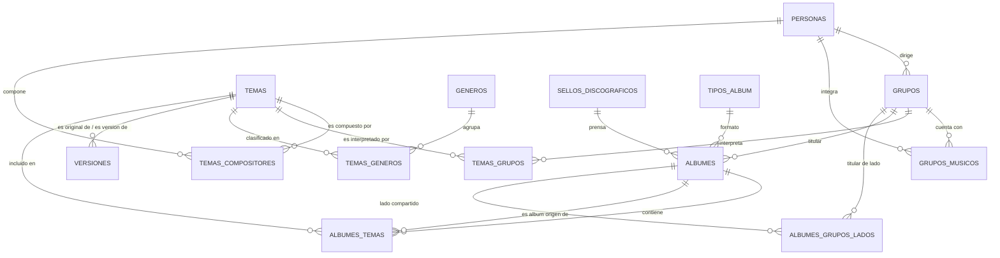

# 🪗 Kumbia Sound: Manifiesto, Arquitectura y Propósito del Proyecto

> **Plataforma Digital de Preservación Fonográfica, Genealogía Musical y Análisis Armónico de la Cumbia Peruana (1968–2005)**

---

## 1. 🎯 ¿De Qué Trata el Proyecto?

**Kumbia Sound** es un archivo digital histórico, musicológico y técnico dedicado al rescate integral de la cumbia grabada en el Perú durante sus décadas formativas y de máxima evolución (1968–2005).

A diferencia de catálogos musicales convencionales o servicios de streaming comerciales, Kumbia Sound está concebido desde la **realidad material del soporte físico** y la historia sociocultural peruana. Documenta la época en que la música no era un archivo digital efímero, sino un objeto industrial y artesanal prensado en **discos de vinilo de 45 RPM, álbumes LP (33 RPM), EPs, Casetes y Discos Compactos (CDs)**, bajo el sello de emblemáticas casas discográficas peruanas como *Infopesa, Discos Horóscopo, Sono Radio, El Virrey, Odeón / IEMPSA, Difa, Discope, Prodic*, entre muchas otras.

El proyecto abarca todas las vertientes que moldearon la identidad tropical del país:
* **Cumbia Costeña y Psicodélica (1968–1975):** La introducción de la guitarra eléctrica fender, pedales wah-wah, eco y fuzz (*Los Destellos, Los Diablos Rojos, Los Ecos, Manzanita y su Conjunto*).
* **Cumbia Amazónica (1970–1980):** Ritmos selváticos con raíces nativas y psicodelia loretana (*Juaneco y su Combo, Los Mirlos, Los Wembler's de Iquitos*).
* **Cumbia Andina y Chicha (1975–1990):** El fenómeno migrante urbano que fusionó el huayno con la guitarra eléctrica y la lírica proletaria (*Chacalón y La Nueva Crema, Los Shapis, Grupo Celeste, Grupo Maravilla, Los Ovnis, Pintura Roja*).
* **Cumbia Norteña y Orquestal (1980–2000):** Secciones de viento, metales y percusión caribeña (*Armonía 10, Agua Marina, Los Titanes*).
* **Tecnocumbia y Sanjuanera (1995–2005):** Sintetizadores digitales, cajas de ritmos y nuevas sonoridades del sur y norte del país.

---

## 2. 🏛️ Finalidad y Pilares del Proyecto

Kumbia Sound cumple cuatro propósitos estratégicos:

### A. Preservación Patrimonial y Memoria Cultural
Muchos de los temas fundamentales de la cumbia peruana solo sobrevivieron en tirajes limitados de vinilos de 45 RPM o en cintas máster deterioradas. El proyecto rescata los créditos reales de autores, compositores, directores de orquesta y músicos de sesión que frecuentemente fueron invisibilizados por la industria.

### B. Genealogía Musical y Árbol de Artistas
En el Perú de los 70 y 80, los músicos virtuosos formaban una red dinámica: un guitarrista tocaba en *Los Destellos*, grababa como sesionista para *El Grupo Celeste* y luego fundaba su propia agrupación. El sistema traza con precisión las fechas de vigencia (`desde` / `hasta`) de cada músico en cada orquesta, sus roles instrumentales y el árbol de **versiones (*covers*)** entre grabaciones originales y reinterpretaciones posteriores.

### C. Herramienta Técnica para DJs e Investigadores (Armonía y Tempo)
Para los selectores de vinilo, DJs contemporáneos y etnomusicólogos, la plataforma provee un motor de búsqueda armónica con métricas de audio analizadas en laboratorio:
* **BPM (Beats Por Minuto):** Tempo exacto para mezcla rítmica.
* **Tonalidad Estándar:** Clave musical (ej. *Am*, *Dm*, *Em*).
* **Rueda Camelot:** Notación armónica (ej. *8A*, *7A*, *9B*) que permite realizar transiciones armónicas matemáticamente perfectas en vivo.

### D. Política Estricta: Archivo Documental Sin Distribución Ilegal de Audio
> [!IMPORTANT]
> **Kumbia Sound NO es un sitio de descargas ni reproducción pirata de audio.**
> La plataforma preserva **metadatos técnicos, musicológicos y rescate gráfico en alta resolución** (carátulas, contraportadas y galletas en formato WebP optimizado). El valor reside en la información estructurada, protegiendo los derechos de autor y las matrices fonográficas.

---

## 3. 🗄️ ¿Cómo Está Construida la Base de Datos?

La base de datos está implementada sobre **PostgreSQL en Supabase**, diseñada bajo un modelo relacional de alta fidelidad que resuelve los desafíos únicos del prensaje físico:



### Categorías de Tablas

#### 1. Tablas Maestras de Entidades del Mundo Real
* **`Personas`:** Identidad biográfica de músicos, directores y compositores (nombre, apodo, lugar de nacimiento, foto).
* **`Grupos`:** Orquestas y conjuntos musicales, vinculados a su director fundador y región de origen.
* **`Sellos_Discograficos`:** Casas disqueras que prensaron el material (Infopesa, Horóscopo, Sono Radio, etc.).
* **`Generos`:** Vertientes musicales estilísticas (Costeña, Amazónica, Chicha, etc.).
* **`Tipos_Album`:** Matriz física de prensaje (`45`, `LP`, `EP`, `Casete`, `CD`).
* **`Roles`:** Especialidades musicales en estudio (*Primera Guitarra, Bajo Eléctrico, Timbales, Coros, Director Musical*).

#### 2. Soporte Físico y Trazabilidad Discográfica (`Albumes`)
La tabla `Albumes` no solo registra un disco, sino que modela la compleja ingeniería comercial peruana:
* **`numero_catalogo`:** Código de fábrica impreso en la galleta y lomo (ej. *ELD-1735*, *HLP-1001*).
* **`id_tipo_album`:** Diferencia si el objeto es un LP de 33 RPM, un sencillo de 45 RPM o un casete.
* **`es_recopilatorio`:** Distingue álbumes con temas de catálogo recopilados frente a grabaciones de estudio originales.
* **`es_varios_artistas`:** Señala si el disco es un compilatorio temático de la disquera (ej. *Éxitos del Día de la Madre*).
* **`es_disco_split`:** Soporte para discos de 45 RPM compartidos por lados (Lado A de un grupo, Lado B de otro grupo).
* **`lados_en_lp`:** Registra si un single de 45 RPM fue incluido en un LP como `'Lado A'`, `'Lado B'` o `'Ambos'`.
* **`incluido_en_lp` / `extraido_de_lp` / `solo_en_45`:** Ciclo de vida del vinilo (si nació como single promocional, si fue un corte derivado de un LP o si es una joya huérfana jamás editada en larga duración).
* **`id_lp_relacionado` / `id_album_original`:** Claves foráneas reflexivas para enlazar reediciones con su matriz original y singles con su LP matriz.

#### 3. Grabaciones y Pistas (`Temas` y Cruces $N:M$)
* **`Temas`:** La unidad sonora grabada (título, duración, BPM, Camelot code, tonalidad, letra indexada en texto completo GIN).
* **`Temas_Generos`:** Relación Muchos a Muchos que permite catalogar **fusiones híbridas** (ej. *Cumbia Costeña* como principal + *Cumbia Psicodélica* como secundaria).
* **`Temas_Compositores`:** Autores intelectuales por pista.
* **`Temas_Grupos`:** Orquestas participantes (artistas principales, invitados o acompañamiento).
* **`Versiones`:** Auto-relación que documenta cuándo una grabación es un *cover* o regrabación de otra canción original.
* **`Albumes_Temas`:** La pista física en el surco del vinilo (número de pista, Lado A o B), incorporando:
  * **`id_album_origen`:** Registra con exactitud de qué single o LP previo provino la cinta máster al ser recopilada.
  * **`es_grabacion_inedita`:** Identifica si la pista fue grabada exclusivamente para ese lanzamiento.
* **`Tema_Musicos`:** Créditos minuciosos de sesión (quién tocó la primera guitarra o los timbales en esa pista específica).

---

## 4. 🔗 ¿Cómo Se Conecta la Información? (El Grafo Fonográfico)

La arquitectura relacional de Kumbia Sound funciona como una red de conocimiento interconectada:

```
[Músico / Persona] 
       │ 
       ├── (integró en 1974) ───► [Grupo Musical]
       │                                │
       └── (grabó sesión en)            │ (grabó en estudio)
               │                        ▼
               ▼                  [Tema / Grabación]
       [Tema_Musicos] ◄─────────── (BPM, Camelot, Letra)
       (ej. Primera Guitarra)           │
                                        ├── (clasificado en) ──► [Temas_Generos] (Fusión)
                                        ├── (compuesto por)  ──► [Compositor]
                                        ├── (versiona a)    ──► [Tema Original]
                                        │
                                        └── (prensado en Lado A, Pista 1)
                                                ▼
                                        [Albumes_Temas]
                                                │
                                                ├── (soporte físico) ─► [Álbum / Vinilo]
                                                └── (audio tomado de) ─► [Single 45 RPM Origen]
```

### Ejemplo de Recorrido de Consulta:
Si un usuario busca el tema **"El Aguajal"**:
1. El sistema recupera el registro en `Temas` con su BPM (98) y clave armónica (9A / Em).
2. Consulta `Temas_Compositores` y descubre que su autor es *Trinidad Hermoza*.
3. Consulta `Temas_Grupos` y determina que fue interpretado por *Los Shapis*.
4. Consulta `Temas_Generos` e identifica que su vertiente es *Cumbia Andina / Chicha*.
5. Consulta `Albumes_Temas` y rastrea todas sus apariciones físicas:
   * Su prensaje original en vinilo de 45 RPM (1981, Discos Horóscopo).
   * Su inclusión en el LP debut *"Los Auténticos Shapis"* (1981).
   * Su reutilización posterior en compilatorios temáticos de la disquera con su `id_album_origen`.
6. Consulta `Versiones` y muestra todas las agrupaciones que posteriormente versionaron la canción.

---

## 5. 🌐 ¿Qué Función Cumple la Aplicación Web en Vercel?

La plataforma web desplegada en **Vercel** (`Next.js App Router + TypeScript + Tailwind CSS`) es la interfaz pública y administrativa que da vida a los datos de Supabase.

### Módulos y Funcionalidades de la Web

| Módulo / Ruta | Propósito | Tecnología / Enfoque |
| :--- | :--- | :--- |
| **Portada Editorial (`/`)** | Exhibición del archivo histórico, selecciones curadas, homenaje a pioneros y acceso al catálogo general. | Diseño editorial brutalista e interactivo con estética vintage. |
| **Ficha de Álbum y Vinilo** | Modal detallado que renderiza la portada en WebP, número de catálogo, sello discográfico, año y tracklist con surcos por Lado A / Lado B. | Componentes accesibles con Tailwind y carga optimizada. |
| **Herramientas DJ (`/match-bpm`)** | Motor de filtrado armónico interactivo por rango de BPM y coincidencia en la **Rueda Camelot** (claves compatibles para mezclas fluidas). | Algoritmo cliente de compatibilidad armónica para DJs. |
| **Explorador Genealógico (`/genealogia`)** | Visualización interactiva de la trayectoria de músicos a través de múltiples agrupaciones y épocas históricas. | Consultas relacionales optimizadas sobre `Grupos_Musicos`. |
| **Radar Sonoro (`/radar`)** | Curaduría de prensajes raros, ediciones en 45 RPM nunca reeditadas y discos *split*. | Filtros discográficos avanzados sobre banderas de soporte físico. |
| **Blog & Crónicas (`/blog`, `/blog/[slug]`)** | Divulgación de investigaciones musicológicas, entrevistas históricas y análisis de matrices fonográficas. | Renderizado de Markdown y Server Components de Next.js. |
| **Panel de Administración (`/admin`, `/admin/login`)** | Espacio restringido para investigadores y catalogadores que permite subir portadas (restringidas a WebP) y actualizar fichas. | Autenticación segura con Supabase Auth y SSR. |
| **Métricas en Producción** | Monitoreo de tráfico, visitas de investigadores y rendimiento global sin almacenar cookies invasivas. | Integración oficial con `@vercel/analytics`. |

---

## 6. 🛡️ Arquitectura de Seguridad y Rendimiento

1. **Row Level Security (RLS) en Supabase:**
   Todas las tablas maestras y relacionales tienen políticas RLS activas:
   * **Lectura pública (`SELECT`):** Acceso universal sin autenticación para que la web pública, DJs e investigadores consulten el catálogo sin trabas.
   * **Escritura restringida (`INSERT`, `UPDATE`, `DELETE`):** Exclusiva para usuarios autenticados bajo el rol de administrador.
2. **Optimización Multimedia:**
   Las imágenes de portadas, galletas y sellos se almacenan en un bucket de Supabase Storage configurado para admitir únicamente formato **WebP**, garantizando cargas ultrarrápidas y bajo consumo de ancho de banda.
3. **Búsqueda Full-Text en Español:**
   Índices invertidos **GIN** con diccionarios en español (`to_tsvector('spanish', letra)`) que permiten buscar canciones por fragmentos de su letra lírica instantáneamente.

---

## 7. 📖 Resumen para el Colaborador o Investigador

Kumbia Sound demuestra que la música popular no debe tratarse como una lista plana de canciones en una tabla de Excel. Al combinar el **rigor relacional de una base de datos normalizada**, la **exactitud musicológica del soporte físico analógico** y una **interfaz moderna de alto impacto visual en Vercel**, el proyecto establece un estándar definitivo para la memoria cultural de la cumbia en el Perú.
