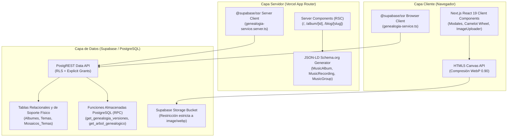
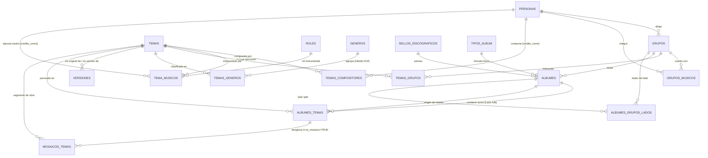

# 🏛️ Arquitectura Técnica y Modelo de Datos: Kumbia Sound

> **Documento de Especificación de Arquitectura de Software, Modelo Relacional Fonográfico y Procedimientos Almacenados en PostgreSQL**

---

## 1. 🌐 Visión General de la Arquitectura

**Kumbia Sound** está diseñado bajo una arquitectura web desacoplada de alto rendimiento, optimizada para la preservación patrimonial, el análisis musicológico y la indexación en motores de búsqueda:



---

## 2. 🗄️ Modelo Relacional Fonográfico

El esquema de base de datos modela la realidad física de la industria fonográfica peruana (1968–2005), estructurándose en tres niveles relacionales: **entidades maestras**, **matrices de soporte físico** y **grabaciones analógicas**.



---

## 3. 🔍 Diccionario de Campos Críticos y Reglas de Negocio

### A. Trazabilidad de Matrices Físicas (`Albumes_Temas.id_album_origen`)
* **Propósito:** En los LPs recopilatorios y reediciones peruanas, las canciones rara vez se grababan en el año de publicación del LP; solían provenir de cintas máster prensadas previamente en sencillos de 45 RPM o compilaciones anteriores.
* **Comportamiento:** `id_album_origen` es una clave foránea hacia `Albumes(id_album)` que registra la matriz fonográfica original. Si un tema se grabó exclusivamente para ese LP, `id_album_origen` es `NULL` y se marca `es_grabacion_inedita = TRUE`.

### B. Banderas Físicas del Soporte (`Albumes`)
| Campo | Tipo | Definición y Propósito |
| :--- | :--- | :--- |
| `es_disco_split` | `BOOLEAN` | Indica si el disco de 45 RPM comparte lados entre dos agrupaciones distintas (gestionado en la tabla `Albumes_Grupos_Lados`). |
| `lados_en_lp` | `VARCHAR(20)` | Para sencillos de 45 RPM, documenta si los surcos fueron incluidos en un LP posterior: `'Lado A'`, `'Lado B'` o `'Ambos'`. |
| `incluido_en_lp` | `BOOLEAN` | Indica si el corte en 45 RPM pasó a formar parte del catálogo de un álbum de larga duración. |
| `extraido_de_lp` | `BOOLEAN` | Señala si el single de 45 RPM fue un corte promocional extraído de un LP previamente masterizado. |
| `solo_en_45` | `BOOLEAN` | Joyas discográficas de catálogo que **únicamente** se prensaron en formato single y jamás fueron recopiladas en LP. |

### C. Manejo de Enganchados (`Albumes_Temas.es_mosaico` y `Mosaicos_Temas`)
* **Surco Físico Contenedor:** La fila en `Albumes_Temas` representa el surco físico real prensado en el vinilo (Lado A o B, número de pista). Si es un potpourri, se define `es_mosaico = TRUE`.
* **Desglose Relacional:** La tabla `Mosaicos_Temas` contiene cada canción que conforma el bloque:
  * `orden_segmento`: Posición secuencial de inicio (1, 2, 3...).
  * `duracion_segmento_segundos`: Duración aproximada del bloque musical.
  * **Integridad:** `UNIQUE (id_album_tema, orden_segmento)` y clave foránea en cascada hacia `Temas(id_tema)`.
  * *Ver detalle de diseño en [ADR 002: Modelado de Mosaicos y Enganchados](adr/002-modelado-mosaicos-y-enganchados.md).*

### D. "Piratería Blanca" y Contratos de Exclusividad (`credito_como`)
* **Contexto:** Músicos con contratos de exclusividad (ej. en *Infopesa*) grababan de incógnito para sellos rivales (*Horóscopo, Sono Radio*) bajo seudónimos en la galleta del vinilo.
* **Solución:** Las tablas `Tema_Musicos` y `Temas_Compositores` cuentan con la columna `credito_como TEXT NULL`.
* **Regla:** La clave foránea apunta a la persona biográfica real (`Personas.id_persona`), asegurando que el grafo de artistas no pierda integridad, mientras que `credito_como` documenta el crédito literal impreso en el disco.

### E. Restricción Estricta de Lados Físicos (Exclusividad Lados A y B)
* Se impone a nivel DDL:
  ```sql
  CONSTRAINT chk_albumes_temas_lados_ab CHECK (lado IS NULL OR lado IN ('A', 'B'));
  CONSTRAINT chk_albumes_grupos_lados_ab CHECK (lado IN ('A', 'B'));
  ```
  *Ver justificación histórica en [ADR 001: Restricción Estricta de Soportes Físicos a Lados A y B](adr/001-soporte-estricto-lados-a-b.md).*

---

## 4. ⚡ Procedimientos Almacenados en PostgreSQL (RPC)

Para eliminar problemas de consultas en cascada ($N+1$) y resolver grafos en un único viaje de red, el sistema cuenta con dos funciones almacenadas en `public` con atributos `SECURITY DEFINER`:

### A. `get_arbol_genealogico(p_persona_id INT)`
* **Firma:** `get_arbol_genealogico(p_persona_id INT) RETURNS JSONB`
* **Propósito:** Resuelve la red biográfica completa de un músico de sesión, compositor o director.
* **Estructura del Payload JSON Retornado:**
  ```json
  {
    "persona": {
      "id_persona": 10,
      "nombre": "Enrique Delgado Montes",
      "apodo": "El Maestro",
      "lugar_nacimiento": "Lima",
      "biografia": "...",
      "url_foto": "..."
    },
    "agrupaciones": [
      {
        "id_grupo": 1,
        "nombre_grupo": "Los Destellos",
        "rol": "Director Musical",
        "desde": null,
        "hasta": null
      }
    ],
    "grabaciones_sesion": [
      {
        "id_tema": 42,
        "titulo_tema": "El Avispón",
        "instrumento": "Primera Guitarra",
        "rol": "Solista",
        "credito_como": null,
        "grupos": ["Los Destellos"],
        "prensajes": [...]
      }
    ],
    "composiciones": [
      {
        "id_tema": 42,
        "titulo_tema": "El Avispón",
        "credito_como": null,
        "duracion_segundos": 165,
        "bpm": 128,
        "camelot_code": "8A",
        "interpretes": ["Los Destellos"],
        "total_versiones": 3
      }
    ]
  }
  ```

### B. `get_genealogia_versiones(p_tema_id INT)`
* **Firma:** `get_genealogia_versiones(p_tema_id INT) RETURNS JSONB`
* **Algoritmo Jerárquico:**
  1. **Ascenso a la Raíz Matriz:** Navegación recursiva ascendente en la tabla `Versiones` para localizar el tema original de referencia (`v_root_id`), independientemente de si la consulta se originó en un cover tardío.
  2. **Descenso con Detección de Ciclos:**
     ```sql
     WITH RECURSIVE arbol_versiones AS (
         -- Caso Base: Tema Raíz Matriz
         SELECT t.id_tema, CAST(NULL AS INT) AS id_tema_original, 0 AS nivel, ARRAY[t.id_tema] AS camino
         FROM Temas t WHERE t.id_tema = v_root_id
         UNION ALL
         -- Caso Recursivo: Derivaciones y Covers
         SELECT v.id_tema, v.id_tema_original, av.nivel + 1, av.camino || v.id_tema
         FROM Versiones v
         JOIN arbol_versiones av ON v.id_tema_original = av.id_tema
         WHERE NOT (v.id_tema = ANY(av.camino)) AND av.nivel < 20
     )
     ```
  3. **Salida Enriquecida:** Retorna `total_nodos`, `total_versiones` y la lista ordenada de `nodos` con sus intérpretes, compositores, clave armónica y prensajes físicos asociados.
  * *Ver detalle técnico en [ADR 003: Resolución de Grafos con RPC y Recursión](adr/003-resolucion-grafo-genealogico-rpc.md).*

---

## 5. 🛡️ Seguridad, RLS y Concesión de Permisos (Data API)

Supabase no concede permisos automáticos sobre nuevas tablas o funciones en la Data API (PostgREST). Toda definición DDL debe implementar explícitamente:

1. **Row Level Security (RLS):**
   * **Lectura Universal:** `SELECT` público habilitado (`USING (true)`) para acceso anónimo de investigadores y DJs.
   * **Mutaciones Restringidas:** `INSERT`, `UPDATE`, `DELETE` permitidos únicamente para roles autenticados de catalogador/administrador (`authenticated`, `service_role`).
2. **Concesión Explícita de Privilegios (`GRANT`):**
   ```sql
   GRANT SELECT, INSERT, UPDATE, DELETE ON TABLE Mosaicos_Temas TO anon, authenticated, service_role;
   GRANT USAGE, SELECT ON SEQUENCE mosaicos_temas_id_mosaico_tema_seq TO anon, authenticated, service_role;
   GRANT EXECUTE ON FUNCTION get_genealogia_versiones(INT) TO anon, authenticated, service_role;
   GRANT EXECUTE ON FUNCTION get_arbol_genealogico(INT) TO anon, authenticated, service_role;
   ```

---

## 6. 💻 Capa Frontend, Arquitectura Modular y SEO Patrimonial

### A. Modularización por Características (`src/features/`)
La lógica de negocio se organiza en submódulos encapsulados en `src/features/`:
* `features/albumes/`: Explorador de catálogo ([CatalogExplorer](file:///c:/Users/CACTU/Downloads/Proyectos/cumbia-peruana/src/features/albumes/components/catalog-explorer.tsx)), tarjeta de vinilo ([AlbumCard](file:///c:/Users/CACTU/Downloads/Proyectos/cumbia-peruana/src/features/albumes/components/album-card.tsx)) y modales de detalle.
* `features/temas/`: Tabla de surcos de vinilo ([TracklistTable](file:///c:/Users/CACTU/Downloads/Proyectos/cumbia-peruana/src/features/temas/components/tracklist-table.tsx)) con pestañas analógicas Lado A / Lado B y soporte visual para mosaicos.
* `features/genealogia/`: Visualizador de redes ([ArbolGenealogicoViewer](file:///c:/Users/CACTU/Downloads/Proyectos/cumbia-peruana/src/features/genealogia/components/arbol-genealogico-viewer.tsx)) y modal de versiones ([VersionesExplorerModal](file:///c:/Users/CACTU/Downloads/Proyectos/cumbia-peruana/src/features/genealogia/components/versiones-explorer-modal.tsx)).
* `features/storage/`: Pipeline cliente Canvas API para WebP ([ImageUploader](file:///c:/Users/CACTU/Downloads/Proyectos/cumbia-peruana/src/features/storage/components/image-uploader.tsx)).
* `features/dj-tools/`: Motor de compatibilidad armónica en la Rueda Camelot y filtros BPM.

### B. Consumo Segregado de Clientes Supabase
```text
Client Components ('use client') ──► genealogia-service.ts        ──► lib/supabase/client.ts
Server Components (RSC)         ──► genealogia-service.server.ts ──► lib/supabase/server.ts
```

### C. SEO Patrimonial y Schema.org (JSON-LD)
En la página dinámica Server Component [`src/app/album/[id]/page.tsx`](file:///c:/Users/CACTU/Downloads/Proyectos/cumbia-peruana/src/app/album/%5Bid%5D/page.tsx), se inyecta dinámicamente un objeto JSON-LD válido:
* **`MusicAlbum`:** Con `name`, `catalogNumber`, `datePublished`, `recordLabel` y lista de canciones `track`.
* **`MusicRecording`:** Cada pista incluye `duration` (ISO 8601), `byArtist` ([MusicGroup]), `composer` ([Person]) y número de pista correspondiente al Lado A o B.

---

## 7. 🔗 Documentación Relacionada
* [Lineamientos de Desarrollo y Estándares](lineamientos-desarrollo.md)
* [Criterios de Catalogación e Investigación](criterios-catalogacion.md)
* [Manifiesto y Alcance Histórico](manifiesto-arquitectura.md)
* [ADRs del Proyecto](adr/)
