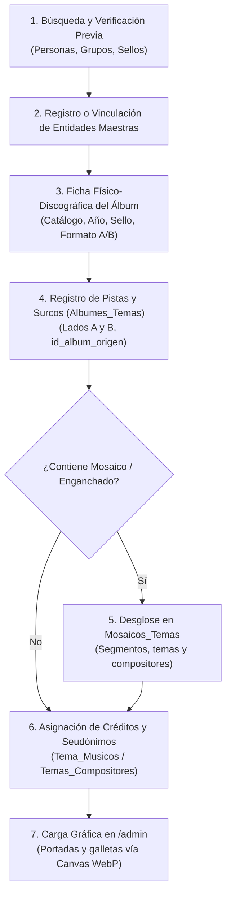

# 📜 Manual de Criterios de Catalogación e Investigación Fonográfica

> **Guía Operativa para Investigadores, Catalogadores y Musicólogos de Kumbia Sound**

---

## 1. 🎯 Propósito del Manual

Este manual establece los criterios normativos, las pautas de verificación y el flujo metodológico para ingresar, auditar y documentar registros en la base de datos de **Kumbia Sound**. 

El objetivo primordial es garantizar la **máxima fidelidad histórica y material al soporte físico original (1968–2005)**, evitando la duplicidad de entidades, protegiendo los derechos morales de los autores y documentando la compleja realidad industrial del vinilo y el casete peruano.

---

## 2. 📋 Paso a Paso para Registrar un Nuevo Álbum o Single

Antes de realizar cualquier inserción en el sistema, el catalogador debe seguir un protocolo estricto de auditoría:



### Paso 1: Búsqueda y Verificación Previa (Prevención de Duplicados)
* **Verificación de Personas:** Consulta la tabla `Personas` antes de registrar un compositor o instrumentista. Busca por nombre legal, apodo artístico y variaciones ortográficas (ej. *"Tito Caycho"* vs. *"Enrique Caycho"*).
* **Verificación de Agrupaciones:** Revisa la tabla `Grupos`. Recuerda que muchas orquestas cambiaron sutilmente de nombre en diferentes prensajes (ej. *"Manzanita y su Conjunto"* vs. *"Manzanita y sus Estrellas"*). Documenta el grupo canónico o asocia un grupo específico si constituyó una formación distinta.
* **Verificación de Sellos:** Comprueba la lista de sellos en `Sellos_Discograficos`. Respeta la nomenclatura de fábrica (*"Discos Horóscopo"*, *"Infopesa"*, *"Sono Radio"*, *"El Virrey"*, *"Odeón / IEMPSA"*).

### Paso 2: Registro de la Ficha Discográfica (`Albumes`)
Al registrar el disco, completa los siguientes atributos esenciales:
* **`numero_catalogo`:** Código de fábrica impreso en el lomo y la galleta (ej. *HLP-1001*, *ELD-1735*, *LPS-2044*). Es la clave de trazabilidad primaria del prensaje.
* **`id_tipo_album`:** Selecciona el formato físico exacto (`LP`, `45`, `EP`, `Casete`, `CD`).
* **`año_publicacion`:** Año exacto de salida de fábrica. En caso de duda o si no figura en la carátula, consulta los números de matriz en el surco de escape (*dead wax*) o los registros tabulares en [`docs/datos-investigacion/`](datos-investigacion/).
* **Banderas de Soporte:**
  * Si es un compilatorio de varios grupos de la disquera: marca `es_varios_artistas = TRUE`.
  * Si es una recopilación de éxitos previos: marca `es_recopilatorio = TRUE`.
  * Si es un 45 RPM compartido por dos orquestas distintas en cada cara: marca `es_disco_split = TRUE` y registra ambas bandas en `Albumes_Grupos_Lados`.

---

## 3. 🔄 Singles de 45 RPM vs. LPs (Reglas de Trazabilidad)

En la industria peruana de la época, el sencillo de 45 RPM de 7 pulgadas era la vanguardia comercial. Muchos temas se grababan, prensaban y promocionaban en 45 RPM meses o años antes de que la disquera decidiera agruparlos en un LP de 33 RPM.

### Reglas de Clasificación:

| Situación del Tema | Configuración en `Albumes` (45 RPM) | Configuración en `Albumes_Temas` (LP) |
| :--- | :--- | :--- |
| **Nació en 45 RPM y luego pasó a un LP:** | `incluido_en_lp = TRUE`<br>`lados_en_lp = 'Lado A'` / `'Lado B'` / `'Ambos'` | `id_album_origen = <id_single_45>`<br>`es_grabacion_inedita = FALSE` |
| **Grabado como corte de LP y luego promocionado en 45:** | `extraido_de_lp = TRUE`<br>`id_lp_relacionado = <id_lp>` | `id_album_origen = NULL`<br>`es_grabacion_inedita = TRUE` |
| **Joya de catálogo jamás editada en LP (Huérfana):** | `solo_en_45 = TRUE`<br>`incluido_en_lp = FALSE` | *(No aplica, no tiene aparición en LP)* |

> [!TIP]
> **Criterio del Máster Original:**
> El atributo `id_album_origen` en `Albumes_Temas` debe apuntar **siempre a la primera aparición física conocida del audio**, no a reediciones intermedias.

---

## 4. 🪗 Cómo Catalogar un Popurrí, Mosaico o Enganchado

Un mosaico musical en vinilo o casete representa **un único surco físico continuo** en el disco, pero agrupa varias canciones encadenadas.

### Protocolo de Ingreso:
1. **Registrar el Surco Físico en `Albumes_Temas`:**
   * Asigna el número de pista y lado según el vinilo físico (ej. Lado A, Pista 4).
   * Asigna el título genérico del bloque como tema contenedor (ej. *"Mosaico N° 1"* o *"Enganchado de Cumbias"*).
   * Marca obligatoriamente la bandera:
     ```sql
     es_mosaico = TRUE
     ```
2. **Registrar los Fragmentos en `Mosaicos_Temas`:**
   * Por cada canción que suena dentro del enganchado, añade un registro en `Mosaicos_Temas`:
     * `id_album_tema`: ID de la pista física contenedora.
     * `id_tema`: ID de la canción específica en el catálogo `Temas`.
     * `orden_segmento`: 1 para la primera canción del enganchado, 2 para la segunda, 3 para la tercera, etc.
     * `duracion_segmento_segundos`: Duración aproximada de ese tramo en segundos (si se cuenta con cronometraje auditivo).
3. **Métricas DJ y Camelot:**
   * El registro padre en `Temas` conserva el tempo promedio y la tonalidad predominante del surco.
   * Los temas individuales enlazados en `Mosaicos_Temas` conservan sus propios compositores y relaciones de versiones originales en el grafo.
   * *Ver justificación de arquitectura en [ADR 002: Modelado de Mosaicos y Enganchados](adr/002-modelado-mosaicos-y-enganchados.md).*

---

## 5. 🎭 Seudónimos y "Piratería Blanca" (`credito_como`)

Durante las décadas de 1970 y 1980 en el Perú, los contratos de exclusividad disquera motivaron que músicos y compositores grabaran clandestinamente para casas discográficas competidoras usando nombres artísticos ficticios.

### Criterio de Catalogación:
* **Entidad Biográfica (`Personas`):** Debe apuntar **siempre a la persona real** (nombre de pila verificado e identidad biográfica).
* **Crédito Literal en el Disco (`credito_como`):** Si en la galleta del vinilo o en la contraportada el músico o compositor fue acreditado con un seudónimo o variante, dicho alias debe ingresarse en la columna `credito_como` de:
  * `Tema_Musicos` (para instrumentistas y sesionistas).
  * `Temas_Compositores` (para autores de letras o música).

### Ejemplos Históricos Comunes:
* **Músicos de Sesión:** Un guitarrista exclusivo de *Infopesa* que grabó los solos de guitarra para un LP en *Discos Horóscopo* acreditado como *"El Zurdo de Oro"* o *"Juan de Dios"*.
  * `id_persona`: ID real del músico.
  * `credito_como`: `"El Zurdo de Oro"`.
* **Compositores con Variantes:** Un compositor registrado como *"P. Castillo"* en la galleta de 45 RPM pero cuyo nombre completo es *"Pedro Castillo Valenzuela"*.
  * `id_persona`: ID de Pedro Castillo Valenzuela.
  * `credito_como`: `"P. Castillo"`.

---

## 6. 🔘 Convención de Banderas y Respuestas Booleanas (SI / Vacío = NO)

Para agilizar el flujo de investigación y catalogación en las hojas de trabajo ([`docs/datos-investigacion/Datos BD.ods`](datos-investigacion/Datos%20BD.ods)), evitando la escritura manual repetitiva de "NO":

* **Comportamiento por Defecto en la Base de Datos:** Todas las columnas booleanas en el esquema PostgreSQL (`es_recopilatorio`, `es_varios_artistas`, `es_disco_split`, `incluido_en_lp`, `extraido_de_lp`, `solo_en_45`, `es_reedicion`, `es_grabacion_inedita`, `es_mosaico`) están modeladas con `DEFAULT FALSE`.
* **Regla Operativa para el Catalogador en Datos BD.ods:**
  * **Condición Afirmativa:** Escribir explícitamente **`SI`**.
  * **Condición Negativa:** **Dejar la casilla vacía** (o en blanco). No es necesario escribir "NO".
* **Regla Mandatoria para Scripts de Ingesta y Agentes AI:** Cualquier celda vacía o nula en estas columnas debe interpretarse e insertarse obligatoriamente como **`NO` / `FALSE`** en las sentencias SQL y la base de datos.

---

## 7. 🖼️ Estándar Multimedia y Carga Gráfica en `/admin`

La preservación patrimonial exige que los escaneos y fotografías de carátulas cumplan con altos estándares visuales:

### Especificaciones para Digitalización Gráfica:
1. **Tipos de Imagen Requeridos por Lanzamiento:**
   * **`url_portada`:** Carátula frontal completa.
   * **`url_contraportada`:** Contraportada con créditos y notas editoriales.
   * **`url_etiqueta`:** Galleta central del disco de vinilo (Lado A o Lado B) donde figuran el número de catálogo y las matrices.
2. **Encuadre y Geometría:**
   * Relación de aspecto **1:1 (cuadrada)** para carátulas de LP y galletas de 45 RPM.
   * Sin deformaciones de perspectiva; imagen plana, sin sombras diagonales ni reflejos directos de flash.
3. **Resolución Recomendada:**
   * Mínimo: 1000 × 1000 px.
   * Óptimo: 1600 × 1600 px.
4. **Pipeline Automatizado en `/admin`:**
   * **No es necesario convertir manualmente a WebP antes de subir:** El componente de administración ([ImageUploader](file:///c:/Users/CACTU/Downloads/Proyectos/cumbia-peruana/src/features/storage/components/image-uploader.tsx)) intercepta automáticamente cualquier archivo `.jpg`, `.jpeg` o `.png`.
   * En el navegador, la Canvas API redimensiona proporcionalmente la imagen a un máximo de 1600 px y la comprime a formato **WebP (calidad 0.90)**, cumpliendo con la política de Supabase Storage.
   * *Ver justificación de arquitectura en [ADR 004: Conversión a WebP en Cliente](adr/004-conversion-cliente-webp.md).*

---

## 8. 🛑 Reglas Negativas Estrictas (Prohibiciones)

1. **PROHIBIDO ingresar Lados C o D:** La música de este archivo (1968–2005) existe estrictamente en **Lado A** y **Lado B**.
2. **PROHIBIDO inventar pistas físicas para popurrís:** Nunca dividas un surco de vinilo en números artificiales de pista (ej. 4.1 o 4b). Usa la tabla relacional `Mosaicos_Temas`.
3. **PROHIBIDO duplicar personas por seudónimos:** Nunca crees una persona nueva en `Personas` si se sabe que es el alias de un músico ya existente; utiliza `credito_como`.
4. **PROHIBIDO almacenar archivos de audio comercial:** Kumbia Sound preserva metadatos, letras líricas y arte gráfico en alta resolución. No almacena ni distribuye archivos MP3/WAV ilegales.

---

## 9. 🔗 Documentación Relacionada
* [Manual del Proyecto para Agentes y Desarrolladores](manual-proyecto.md)
* [Arquitectura Técnica y Datos](arquitectura-tecnica.md)
* [Lineamientos de Desarrollo y Seguridad](lineamientos-desarrollo.md)
* [Manifiesto del Proyecto](manifiesto-arquitectura.md)
* [ADRs del Proyecto](adr/)
