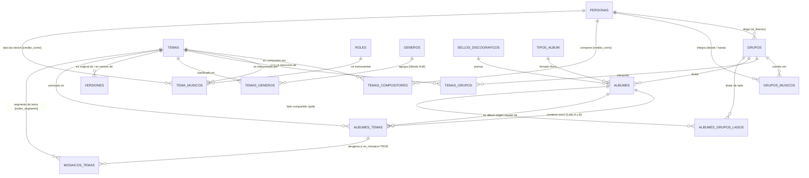

# 🪗 Kumbia Sound: Manifiesto, Arquitectura y Propósito del Proyecto

> **Plataforma Digital de Preservación Fonográfica, Genealogía Musical y Análisis Armónico de la Cumbia Peruana (1968–2005)**

---

## 1. 🎯 ¿De Qué Trata el Proyecto?

**Kumbia Sound** es un archivo digital histórico, musicológico y técnico dedicado al rescate integral de la cumbia grabada en el Perú durante sus décadas formativas y de máxima evolución (1968–2005).

A diferencia de catálogos musicales convencionales o servicios de streaming comerciales, Kumbia Sound está concebido desde la **realidad material del soporte físico** y la historia sociocultural peruana. Documenta la época en que la música no era un archivo digital efímero, sino un objeto industrial y artesanal prensado en **discos de vinilo de 45 RPM (singles), álbumes LP (33 RPM), EPs, Casetes y Discos Compactos (CDs)**, bajo el sello de emblemáticas casas discográficas peruanas como *Infopesa, Discos Horóscopo, Sono Radio, El Virrey, Odeón / IEMPSA, Difa, Discope, Prodic*, entre muchas otras.

El proyecto abarca todas las vertientes que moldearon la identidad tropical del país:
* **Cumbia Costeña y Psicodélica (1968–1975):** La introducción de la guitarra eléctrica Fender, pedales wah-wah, eco y fuzz (*Los Destellos, Los Diablos Rojos, Los Ecos, Manzanita y su Conjunto*).
* **Cumbia Amazónica (1970–1980):** Ritmos selváticos con raíces nativas y psicodelia loretana (*Juaneco y su Combo, Los Mirlos, Los Wembler's de Iquitos*).
* **Cumbia Andina y Chicha (1975–1990):** El fenómeno migrante urbano que fusionó el huayno con la guitarra eléctrica y la lírica proletaria (*Chacalón y La Nueva Crema, Los Shapis, Grupo Celeste, Grupo Maravilla, Los Ovnis, Pintura Roja*).
* **Cumbia Norteña y Orquestal (1980–2000):** Secciones de viento, metales y percusión caribeña (*Armonía 10, Agua Marina, Los Titanes*).
* **Tecnocumbia y Sanjuanera (1995–2005):** Sintetizadores digitales, cajas de ritmos y nuevas sonoridades del sur y norte del país.

---

## 2. 🏛️ Finalidad y Pilares del Proyecto

Kumbia Sound cumple cinco propósitos estratégicos:

### A. Preservación Patrimonial y Memoria Cultural
Muchos de los temas fundamentales de la cumbia peruana solo sobrevivieron en tirajes limitados de vinilos de 45 RPM o en cintas máster deterioradas. El proyecto rescata los créditos reales de autores, compositores, directores de orquesta y músicos de sesión que frecuentemente fueron invisibilizados por la industria.

### B. Genealogía Musical y Red de Sesionistas
En el Perú de los 70 y 80, los músicos virtuosos formaban una red dinámica: un guitarrista tocaba en *Los Destellos*, grababa como sesionista para *El Grupo Celeste* y luego fundaba su propia agrupación. El sistema traza con precisión las fechas de vigencia (`desde` / `hasta`) de cada músico en cada orquesta, sus roles instrumentales y el árbol genealógico completo de **versiones (*covers*) y regrabaciones**.

### C. Herramienta Técnica para DJs e Investigadores (Armonía y Tempo)
Para los selectores de vinilo, DJs contemporáneos y etnomusicólogos, la plataforma provee un motor de búsqueda armónica con métricas de audio analizadas:
* **BPM (Beats Por Minuto):** Tempo exacto para mezcla rítmica.
* **Tonalidad Estándar:** Clave musical (ej. *Am*, *Dm*, *Em*).
* **Rueda Camelot:** Notación armónica (ej. *8A*, *7A*, *9B*) que permite realizar transiciones armónicas matemáticas en vivo.

### D. SEO Patrimonial y Estándares Web Semántica
El proyecto implementa datos estructurados válidos de **Schema.org (`MusicAlbum`, `MusicRecording`, `MusicGroup`, `Person`, `RecordLabel`)** en sus páginas dinámicas de servidor. Esto posiciona a Kumbia Sound como la fuente canónica de verdad fonográfica frente a motores de búsqueda internacionales.

### E. Política Estricta: Archivo Documental Sin Distribución Ilegal de Audio
> [!IMPORTANT]
> **Kumbia Sound NO es un sitio de descargas ni streaming ilegal de audio.**
> La plataforma preserva **metadatos técnicos, musicológicos y rescate gráfico en alta resolución** (carátulas, contraportadas y galletas en formato WebP optimizado). El valor reside en la información estructurada, protegiendo los derechos de autor y las matrices fonográficas.

---

## 3. 🗄️ ¿Cómo Está Construida la Base de Datos?

La base de datos está implementada sobre **PostgreSQL en Supabase**, diseñada bajo un modelo relacional de alta fidelidad que resuelve los desafíos únicos del prensaje físico:



---

### Categorías de Tablas y Entidades

#### 1. Tablas Maestras de Entidades del Mundo Real
* **`Personas`:** Identidad biográfica de músicos, directores y compositores (nombre, apodo, lugar de nacimiento, foto).
* **`Grupos`:** Orquestas y conjuntos musicales, vinculados a su director fundador y región de origen.
* **`Sellos_Discograficos`:** Casas disqueras que prensaron el material (*Infopesa, Horóscopo, Sono Radio, El Virrey*, etc.).
* **`Generos`:** Vertientes musicales estilísticas (Costeña, Amazónica, Chicha, etc.).
* **`Tipos_Album`:** Matriz física de prensaje (`45`, `LP`, `EP`, `Casete`, `CD`).
* **`Roles`:** Especialidades instrumentales en estudio (*Primera Guitarra, Bajo Eléctrico, Timbales, Coros, Director Musical*).

#### 2. Soporte Físico y Trazabilidad Discográfica (`Albumes`)
La tabla `Albumes` modela con precisión la ingeniería de comercialización fonográfica peruana:
* **`numero_catalogo`:** Código de fábrica impreso en la galleta y lomo (ej. *ELD-1735*, *HLP-1001*).
* **`id_tipo_album`:** Diferencia si el objeto es un LP de 33 RPM, un sencillo de 45 RPM o un casete.
* **`es_recopilatorio`:** Distingue recopilatorios de catálogo de grabaciones concebidas como LP de estudio.
* **`es_varios_artistas`:** Señala si el disco es un compilatorio de varios grupos de la disquera.
* **`es_disco_split`:** Soporte para discos de 45 RPM compartidos por lados (Lado A de un grupo, Lado B de otro grupo).
* **`lados_en_lp`:** Registra si un single de 45 RPM fue incluido en un LP como `'Lado A'`, `'Lado B'` o `'Ambos'`.
* **`incluido_en_lp` / `extraido_de_lp` / `solo_en_45`:** Ciclo de vida del vinilo (si nació como single promocional, si fue un corte derivado de un LP o si es una pista huérfana jamás editada en LP).
* **`id_lp_relacionado` / `id_album_original`:** Claves foráneas reflexivas para enlazar reediciones con su matriz original.

#### 3. Pistas Físicas y Surcos del Vinilo (`Albumes_Temas`)
Representa el surco físico grabado en el disco:
* **`lado`:** Restringido obligatoriamente a `'A'` o `'B'` (`CHECK (lado IN ('A', 'B'))`). En la época histórica de 1968–2005 no existen lados C ni D.
* **`numero_pista`:** Posición física de la pista en el lado correspondiente.
* **`id_album_origen`:** Rastrea con exactitud la cinta máster original de donde provino el audio al compilarse.
* **`es_grabacion_inedita`:** Indica si el corte se estrenó exclusivamente para ese lanzamiento.
* **`es_mosaico`:** Bandera booleana que indica si la pista física agrupa un enganchado de múltiples canciones.

---

### Solución a Particularidades Históricas del Catálogo Fonográfico

#### A. Seudónimos y Créditos Reales: "Piratería Blanca" y Contratos de Exclusividad
* **Contexto Histórico:** Durante los años 70 y 80 en Lima, destacados guitarristas y percusionistas firmaban contratos de exclusividad con sellos líderes (por ejemplo, *Infopesa* o *El Virrey*). No obstante, eran contratados clandestinamente por sellos rivales (*Discos Horóscopo, Sono Radio*) para grabar en sesiones de estudio bajo seudónimos ficticios o variantes humorísticas impresas en los créditos físicos de la galleta.
* **Solución en Base de Datos:**
  * Se añadieron las columnas `credito_como TEXT NULL` en `Tema_Musicos` y `Temas_Compositores`.
  * **Ventaja Arquitectural:** La clave foránea apunta siempre a la persona biográfica real (`Personas.id_persona`), lo que preserva la integridad del grafo genealógico, mientras que `credito_como` documenta el crédito literal impreso en el disco de vinilo.

#### B. Mosaicos, Popurrís y Enganchados
* **Contexto Histórico:** En LPs y Casetes de cumbia peruana era sumamente común que una pista física fuera un enganchado continuo (potpourri) de 2 a 4 composiciones con autores y registros distintos.
* **Solución en Base de Datos:**
  * Se mantiene la pista física unitaria en `Albumes_Temas` con la bandera `es_mosaico = TRUE` y sus métricas de surco físico.
  * Se implementó la tabla relacional `Mosaicos_Temas`:
    ```sql
    CREATE TABLE Mosaicos_Temas (
        id_mosaico_tema SERIAL PRIMARY KEY,
        id_album_tema INT NOT NULL REFERENCES Albumes_Temas(id_album_tema) ON DELETE CASCADE,
        id_tema INT NOT NULL REFERENCES Temas(id_tema) ON DELETE CASCADE,
        orden_segmento SMALLINT NOT NULL,
        duracion_segmento_segundos INT DEFAULT NULL,
        UNIQUE (id_album_tema, orden_segmento),
        CONSTRAINT chk_orden_segmento_pos CHECK (orden_segmento > 0)
    );
    ```
  * **Ventaja Arquitectural:** Preserva la autoría intelectual de cada compositor por segmento sin inventar surcos físicos inexistentes ni distorsionar los datos de BPM y clave Camelot de la pista general.

#### C. Clasificación Multigénero Híbrida (`Temas_Generos`)
* Permite vincular un tema a múltiples vertientes simultáneas (ej. *Cumbia Costeña Psicodélica* como vertiente principal y *Cumbia Andina* como vertiente de fusión secundaria).

---

## 4. 🔗 ¿Cómo Se Conecta la Información? (El Grafo Fonográfico)

La arquitectura relacional de Kumbia Sound conecta entidades en una red de conocimiento profunda:

```text
[Músico / Persona] 
       │ 
       ├── (integró 1974-1979) ──► [Grupo Musical]
       │                                │
       └── (grabó sesión con crédito)   │ (grabó en estudio)
           [credito_como]               ▼
               │                  [Tema / Grabación]
               ▼                  (BPM, Camelot, Letra)
       [Tema_Musicos] ◄───────────      │
       (ej. Primera Guitarra)           ├── (clasificado en) ──► [Temas_Generos] (Fusión)
                                        ├── (compuesto por)  ──► [Compositor] [credito_como]
                                        ├── (versiona a)    ──► [Tema Original]
                                        │
                                        └── (prensado en Lado A, Pista 1)
                                                ▼
                                        [Albumes_Temas] (es_mosaico)
                                                │
                                                ├── [es_mosaico=TRUE] ──► [Mosaicos_Temas]
                                                ├── (soporte físico)  ──► [Álbum / Vinilo]
                                                └── (audio master de) ──► [Single 45 RPM Origen]
```

---

### Optimización de Consultas en PostgreSQL (RPCs y Recursión)

Para evitar el problema de consultas en cascada ($N+1$ *waterfall* en el cliente mediante múltiples `.select()`), la base de datos incorpora **procedimientos almacenados (RPC)** que devuelven estructuras JSON optimizadas en un único viaje de red:

#### 1. `get_arbol_genealogico(p_persona_id INT)`
Devuelve en un solo payload JSON:
* Datos biográficos de la persona.
* Agrupaciones fundadas o dirigidas como Director Musical.
* Agrupaciones integradas como músico de planta con sus rangos temporales (`desde` / `hasta`).
* Grabaciones de sesión instrumental en las que participó (`Tema_Musicos`), detallando el rol, el crédito literal (`credito_como`), grupos y prensajes físicos.
* Obras compuestas por la persona, sus intérpretes y el recuento total de versiones existentes.

#### 2. `get_genealogia_versiones(p_tema_id INT)` (Grafo con `WITH RECURSIVE`)
Resuelve el árbol genealógico completo de una canción:
1. **Búsqueda Ascendente:** Mediante una expresión de tabla común recursiva (`WITH RECURSIVE ancestros`), escala por la tabla `Versiones` hasta encontrar el tema original raíz matriz (`v_root_id`).
2. **Expansión Descendente:** Desde la raíz matriz, desciende recolectando todos los *covers* y regrabaciones derivadas.
3. **Prevención de Ciclos:** Utiliza un arreglo de seguimiento de caminos (`camino || v.id_tema` y `WHERE NOT (v.id_tema = ANY(av.camino))`) con un límite de seguridad de profundidad.
4. **Respuesta Enriquecida:** Cada nodo devuelto incluye nivel de profundidad, agrupaciones intérpretes, compositores con `credito_como` y prensajes físicos.

---

## 5. 🌐 ¿Qué Función Cumple la Aplicación Web en Vercel?

La aplicación web desplegada en **Vercel** (`Next.js App Router + TypeScript + Tailwind CSS`) es la interfaz pública, editorial y administrativa que interactúa con Supabase:

### Módulos y Funcionalidades de la Web

| Módulo / Ruta | Propósito | Tecnología / Enfoque |
| :--- | :--- | :--- |
| **Portada Editorial (`/`)** | Catálogo general, selecciones curadas, homenaje a pioneros y acceso a módulos temáticos. | Server Component con diseño brutalista y animaciones optimizadas. |
| **Ficha de Álbum (`/album/[id]`)** | Vista detallada del lanzamiento físico: portada en WebP, sello, catálogo, tracklist con surcos A/B y desglose de mosaicos. | Server Component con `revalidate = 120` y datos estructurados Schema.org. |
| **Herramientas DJ (`/match-bpm`)** | Motor de búsqueda armónica interactivo por rango de BPM y claves en la **Rueda Camelot** para transiciones fluidas. | Componente cliente reactivo con algoritmo de compatibilidad armónica. |
| **Explorador Genealógico (`/genealogia`)** | Visualización interactiva de la trayectoria de músicos, orquestas y líneas de tiempo. | Consumo de la RPC `get_arbol_genealogico` desde el cliente. |
| **Radar Sonoro (`/radar`)** | Curaduría de prensajes raros, singles de 45 RPM nunca reeditados en LP y discos *split*. | Filtros discográficos avanzados sobre metadatos de soporte físico. |
| **Blog & Crónicas (`/blog`, `/blog/[slug]`)** | Divulgación de investigaciones musicológicas, entrevistas históricas y análisis de matrices fonográficas. | Renderizado de Markdown y Server Components de Next.js. |
| **Panel de Administración (`/admin`, `/admin/login`)** | Gestión de portadas y metadatos con autenticación administrativa. | Supabase Auth SSR y componente `ImageUploader` con Canvas WebP. |

---

## 6. 🛡️ Arquitectura de Seguridad, Rendimiento y Multimedia

1. **Row Level Security (RLS) y Data API Grants:**
   * Todas las tablas maestras y relacionales tienen políticas RLS activas con lectura pública y escritura restringida a usuarios autenticados.
   * Toda tabla y función RPC cuenta con permisos explícitos de `GRANT ... TO anon, authenticated, service_role` para garantizar la compatibilidad con PostgREST.
2. **Pipeline de Carga Multimedia con Canvas API (`/admin`):**
   * Supabase Storage exige estrictamente formato **WebP**.
   * El componente `ImageUploader` intercepta en el navegador archivos `.jpg`, `.jpeg` o `.png`, los escala y los comprime a `.webp` (calidad 0.90) en un canvas HTML5 antes del envío, mostrando estadísticas de reducción y progreso visual.
3. **Búsqueda Full-Text en Español:**
   * Índices invertidos **GIN** con diccionarios en español (`to_tsvector('spanish', letra)`) que permiten buscar canciones por fragmentos líricos de forma instantánea.
4. **SEO Patrimonial (Schema.org / JSON-LD):**
   * Emisión de etiquetas `<script type="application/ld+json">` con esquemas `MusicAlbum`, `MusicRecording`, `MusicGroup`, `Person` y `RecordLabel` en páginas de servidor.

---

## 7. 📖 Conclusión

**Kumbia Sound** combina el **rigor relacional de una base de datos normalizada**, la **fidelidad histórica al soporte físico analógico (1968–2005)** y una **arquitectura moderna y eficiente en Next.js y Supabase**, consolidándose como la plataforma definitiva de preservación del patrimonio fonográfico de la cumbia peruana.

---

## 8. 🔗 Documentación Relacionada
* [Arquitectura Técnica y Modelo de Datos](arquitectura-tecnica.md)
* [Lineamientos de Desarrollo y Estándares de Ingeniería](lineamientos-desarrollo.md)
* [Manual de Criterios de Catalogación e Investigación](criterios-catalogacion.md)
* [Registros de Decisiones de Arquitectura (ADRs)](adr/README.md)
* [Datos Tabulares y Notas de Investigación](datos-investigacion/)

