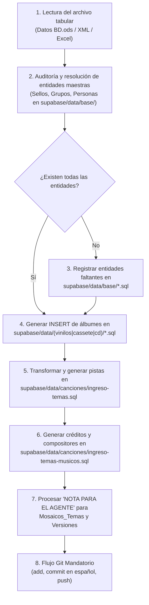

# 📜 Manual de Catalogación, Investigación e Ingesta Fonográfica a SQL

> **Guía Operativa para Investigadores, Catalogadores y Protocolo Mandatorio de Ingesta para Agentes de IA en Kumbia Sound**

---

## 1. 🎯 Propósito del Manual

Este documento cumple un **doble propósito fundamental** dentro del ecosistema de **Kumbia Sound**:

1. **Guía Metodológica para Catalogadores e Investigadores:** Establece las directrices musicológicas y operativas para investigar, tabular y auditar discos de cumbia peruana (1968–2005) en las hojas de trabajo ([`docs/datos-investigacion/Datos BD.ods`](datos-investigacion/Datos%20BD.ods)), garantizando la fidelidad histórica al soporte físico original (vinilo, casete, CD).
2. **Protocolo Mandatorio de Ingesta para Agentes de IA:** Define las reglas algorítmicas, transformaciones de tipos de datos, resolución de entidades y generación de sentencias SQL que cualquier agente de IA debe ejecutar al leer las hojas de cálculo y poblar los archivos `.sql` en [`supabase/data/`](../supabase/data/).

---

## 2. 🗂️ Estructura del Archivo de Investigación (`Datos BD.ods`)

El archivo principal de investigación se encuentra en [`docs/datos-investigacion/Datos BD.ods`](datos-investigacion/Datos%20BD.ods) (también convertible o exportable a Excel o XML) y está compuesto por las siguientes hojas:

* **Hoja Histórica de Referencia:**
  * `45s`: Catálogo maestro histórico preliminar de singles de 45 RPM.
* **Hojas de Registro de Lanzamientos / Álbumes (Fichas Físicas):**
  * `Ingreso Singles` (Discos de 45 RPM / 7'')
  * `Ingreso LP` (Long Plays de 33 RPM / 12'')
  * `Ingreso EP` (Extended Plays de 7'' / 4 cortes)
  * `Ingreso Cassete` (Casetes de cinta magnética)
  * `Ingreso CD` (Discos compactos)
* **Hojas de Registro de Pistas y Contenido Musical:**
  * `Temas Singles`
  * `Temas LP`
  * `Temas EP`
  * `Temas Cassete`
  * `Temas CD`

### Estructura de Filas en las Plantillas:
* **Fila 1:** Encabezados técnicos canónicos de cada columna (en MAYÚSCULAS).
* **Fila 2:** Subtítulos de instrucción y formato (ej. formato de texto, valores permitidos, banderas booleanas).
* **Fila 3 en adelante:** Datos reales catalogados por el investigador.

---

## 3. 🤖 Protocolo del Agente de IA para Poblar los Archivos `.sql`

Cuando un usuario solicite al agente de IA leer los datos de `Datos BD.ods` (o archivos derivados) y trasladarlos a la base de datos del proyecto, el agente **debe seguir este flujo estricto y ordenado**:



### Mapa de Archivos SQL de Destino en el Repositorio:
* **Entidades Maestras (`supabase/data/base/`):**
  * `sellos.sql` $\rightarrow$ Tabla `Sellos_Discograficos`
  * `grupos.sql` $\rightarrow$ Tabla `Grupos`
  * `personas.sql` $\rightarrow$ Tabla `Personas`
  * `generos.sql` $\rightarrow$ Tabla `Generos`
  * `tipo_album.sql` $\rightarrow$ Tabla `Tipo_Album`
* **Lanzamientos y Soportes Físicos (`supabase/data/`):**
  * `vinilos/ingreso-singles.sql` $\rightarrow$ Singles de 45 RPM en `Albumes`
  * `vinilos/ingreso-lp-*.sql` $\rightarrow$ LPs organizados por disquera (`ingreso-lp-horoscopo.sql`, `ingreso-lp-infopesa.sql`, `ingreso-lp-sonoradio.sql`, etc.)
  * `vinilos/ingreso-EP.sql` $\rightarrow$ EPs en `Albumes`
  * `cassete/ingreso-casetes.sql` $\rightarrow$ Casetes en `Albumes`
  * `cd/ingreso-cd.sql` $\rightarrow$ Discos compactos en `Albumes`
* **Canciones, Pistas y Créditos (`supabase/data/canciones/`):**
  * `ingreso-temas.sql` $\rightarrow$ Inserciones en `Temas`, `Albumes_Temas`, `Temas_Grupos`, `Temas_Generos`
  * `ingreso-temas-musicos.sql` $\rightarrow$ Inserciones en `Temas_Compositores` y `Tema_Musicos`
  * `ingreso-versiones.sql` $\rightarrow$ Inserciones en `Versiones` (genealogía de covers)
  * Segmentos de popurrís $\rightarrow$ Inserciones en `Mosaicos_Temas`

---

## 4. ⚙️ Reglas Mandatorias de Conversión y Parseo para el Agente

Al transformar los registros de la hoja de cálculo a sentencias SQL, el agente debe aplicar sin excepción las siguientes transformaciones:

### 4.1. Conversión de Duración de Temas (`MM:SS` $\rightarrow$ Segundos Totales)
* **Formato en la Hoja:** El catalogador introduce la duración en minutos y segundos (ej. `02:50`, `3:15`, `04:02`, `1:08`).
* **Regla Mandatoria para el Agente:** El agente **DEBE CONVERTIR SIEMPRE** el valor a **segundos totales (número entero)** para almacenarlo en `duracion_segundos` (tabla `Temas`) o `duracion_segmento_segundos` (tabla `Mosaicos_Temas`).
* **Fórmula de Conversión:**
  $$\text{duracion\_segundos} = (\text{minutos} \times 60) + \text{segundos}$$
* **Tabla de Equivalencias Comunes:**
  | Entrada en Hoja (`MM:SS`) | Cálculo Matemático | Valor Insertado en SQL (`duracion_segundos`) |
  | :--- | :--- | :--- |
  | `01:08` | $(1 \times 60) + 8$ | `68` |
  | `02:30` | $(2 \times 60) + 30$ | `150` |
  | `02:50` | $(2 \times 60) + 50$ | `170` |
  | `03:00` | $(3 \times 60) + 0$ | `180` |
  | `03:15` | $(3 \times 60) + 15$ | `195` |
  | `03:45` | $(3 \times 60) + 45$ | `225` |
  | `04:02` | $(4 \times 60) + 2$ | `242` |
* *Nota:* Si la casilla en la hoja ya contuviera un valor numérico entero (ej. `185`), se mantiene tal cual como entero. Si la celda está vacía, se inserta `NULL`. **Nunca insertar cadenas de texto con dos puntos (`'02:50'`) en columnas enteras.**

---

### 4.2. Clave Armónica: Exclusividad Estricta de Camelot Key (Sin Círculo de Quintas)
* **Regla del Proyecto:** En **Kumbia Sound** la tonalidad armónica se gestiona **ÚNICA Y EXCLUSIVAMENTE mediante el sistema de notación Camelot** (`camelot_code`), diseñado para mezclas armónicas DJ y análisis armónico rápido.
* **Exclusión de la Notación Tradicional:** La notación musical clásica del Círculo de Quintas (ej. `Am`, `C Major`, `Fa menor`, `Sol sostenido menor`, etc.) **NO SE TENDRÁ EN CUENTA EN EL PROYECTO**.
* **Comportamiento del Agente en SQL:**
  * El código introducido en la columna `TONO / CAMELOT` (ej. `8A`, `9A`, `11B`, `7A`, `4B`) debe insertarse directamente en `camelot_code VARCHAR(10)`.
  * La columna legacy `musical_key` no se poblará o se mantendrá como `NULL`.
  * Valores válidos de Camelot: números del `1` al `12` acompañados estrictamente de `A` (modo menor) o `B` (modo mayor), por ejemplo: `1A`, `1B`, `2A`, `2B`, ..., `12A`, `12B`.

---

### 4.3. Banderas Booleanas: Convención `SI` / Vacío = `NO` (`FALSE`)
* **Comportamiento en Base de Datos:** Todas las columnas booleanas en PostgreSQL (`es_recopilatorio`, `es_varios_artistas`, `es_disco_split`, `incluido_en_lp`, `extraido_de_lp`, `solo_en_45`, `es_reedicion`, `es_grabacion_inedita`, `es_mosaico`) poseen `DEFAULT FALSE`.
* **Regla de Interpretación para el Agente:**
  * Si la celda contiene **`SI`** (o `SÍ`): Generar **`TRUE`**.
  * Si la celda está **vacía, en blanco o sin contenido**: Generar obligatoriamente **`FALSE`**.
  * El agente jamás debe interpretar una casilla vacía como un valor faltante dudoso ni omitir la columna dejando `NULL` indebido; el vacío es explícitamente `FALSE`.

---

### 4.4. Estructura y Separación Estricta de las Tres Columnas Finales en Temas

En todas las hojas de registro de canciones (`Temas Singles`, `Temas LP`, `Temas EP`, `Temas Cassete`, `Temas CD`), existen tres columnas finales claramente diferenciadas para evitar contaminación de datos:

| Columna en la Hoja | Destino / Propósito | ¿Va a la Base de Datos? |
| :--- | :--- | :--- |
| **`LETRA DEL TEMA`** | Letra lírica transcrita completa (o estrofas clave) del tema. | **SÍ** $\rightarrow$ Columna `letra TEXT` en la tabla `Temas`. *(Si el tema es instrumental, se deja vacía y se inserta `NULL`).* |
| **`NOTA PARA EL AGENTE`** | **CANAL DE COMUNICACIÓN INTERNO CATALOGADOR $\rightarrow$ AGENTE AI.** Contiene instrucciones de ingesta, desglose de mosaicos, títulos para enlazar en versiones, y advertencias. | **NO directamente como texto.** El agente debe leer e interpretar su contenido para crear relaciones relacionales en `Mosaicos_Temas` o `Versiones`. |
| **`COMENTARIOS / NOTAS`** | Observaciones musicológicas, técnicas o históricas del tema (ej. cantante solista invitado, primera grabación con pedal fuzz, créditos de prensaje). | **SÍ** $\rightarrow$ Columna `comentario` en `Albumes` o notas descriptivas. |

---

### 4.5. Compositor Real vs. Crédito en Galleta / Etiqueta (`credito_como`)

Durante la época de oro de la cumbia peruana (décadas de 1970 y 1980), los contratos de exclusividad y la "piratería blanca" obligaron a compositores y músicos a firmar con seudónimos en etiquetas de sellos competidores.

* **Regla de Inserción para el Agente:**
  1. **Identidad Biográfica (`Personas`):** Debe vincularse siempre al ID de la persona real con su nombre legal verificado (ej. `Pedro Castillo Valenzuela`, `Enrique Delgado Montes`, `Carlos Baquerizo Castro`). Si no existe en `supabase/data/base/personas.sql`, debe registrarse allí primero.
  2. **Crédito en el Disco (`credito_como`):** El valor que el catalogador haya colocado en la columna `CRÉDITO EN GALLETA (SEUDÓNIMO)` (ej. *"P. Castillo"*, *"Juan de Dios"*, *"El Zurdo de Oro"*) debe insertarse en:
     * `credito_como` de la tabla `Temas_Compositores` (para autores).
     * `credito_como` de la tabla `Tema_Musicos` (para instrumentistas).
  3. Si la columna en la hoja está vacía (significa que en el disco figuraba su nombre normal o no hubo seudónimo), se inserta `NULL` en `credito_como`.

---

### 4.6. Lados Físicos Estrictos: Lado A y Lado B

* **Regla Absoluta:** En el archivo histórico de vinilos y casetes peruanos **solo existen Lado A y Lado B**.
* **Comportamiento del Agente:**
  * Si la celda indica `A`, `Lado A`, `Cara A` $\rightarrow$ Mapear estrictamente a `'A'`.
  * Si la celda indica `B`, `Lado B`, `Cara B` $\rightarrow$ Mapear estrictamente a `'B'`.
  * **PROHIBIDO** admitir, generar o insertar valores como `'C'`, `'D'` o lados ficticios. La base de datos tiene una restricción `CHECK (lado IN ('A', 'B'))`.

---

## 5. 🪗 Protocolo para Popurrís, Mosaicos y Enganchados

Un mosaico musical en vinilo o casete representa **un único surco físico continuo** en el disco, pero agrupa varias composiciones encadenadas.

### Procedimiento del Agente al Encontrar `¿ES MOSAICO? = SI`:
1. **Registro del Surco Físico en `Albumes_Temas`:**
   * Registra la pista física asignando `numero_pista` y `lado`.
   * Asigna el título general del enganchado en `Temas` (ej. *"Mosaico N° 1"*, *"Parranda Sanjuanera"*, *"Enganchado de Cumbias"*).
   * Marca obligatoriamente:
     ```sql
     es_mosaico = TRUE
     ```
2. **Interpretación de la Columna `NOTA PARA EL AGENTE`:**
   * El catalogador escribe en esta columna la lista de canciones contenidas en el mosaico, por ejemplo:
     > *"1. Colegiala (Walter León) / 2. Cariñito (Ángel Rosado) / 3. El Aguajal (Los Shapis)"*
   * El agente debe buscar los IDs de cada uno de esos temas en la tabla `Temas` (o generar sus inserciones si no existen).
3. **Inserción de Segmentos en `Mosaicos_Temas`:**
   * Por cada canción detectada en la nota, genera una fila en `Mosaicos_Temas`:
     ```sql
     INSERT INTO Mosaicos_Temas (id_album_tema, id_tema, orden_segmento, duracion_segmento_segundos)
     VALUES (<id_album_tema>, <id_tema_cancion>, <orden>, <duracion_en_segundos_o_null>);
     ```

---

## 6. 🔄 Singles de 45 RPM vs. LPs (Reglas de Trazabilidad)

| Situación del Tema | Configuración en `Albumes` (45 RPM) | Configuración en `Albumes_Temas` (LP) |
| :--- | :--- | :--- |
| **Nació en 45 RPM y luego pasó a un LP:** | `incluido_en_lp = TRUE`<br>`lados_en_lp = 'Lado A'` / `'Lado B'` / `'Ambos'` | `id_album_origen = <id_single_45>`<br>`es_grabacion_inedita = FALSE` |
| **Grabado como corte de LP y luego promocionado en 45:** | `extraido_de_lp = TRUE`<br>`id_lp_relacionado = <id_lp>` | `id_album_origen = NULL`<br>`es_grabacion_inedita = TRUE` |
| **Joya exclusiva de 45 jamás editada en LP (Huérfana):** | `solo_en_45 = TRUE`<br>`incluido_en_lp = FALSE` | *(No aplica, no tiene aparición en LP)* |

> [!TIP]
> **Criterio del Máster Original:**
> El atributo `id_album_origen` en `Albumes_Temas` debe apuntar **siempre a la primera aparición física conocida del audio**, no a reediciones intermedias.

---

## 7. 🖼️ Estándar Multimedia y Carga Gráfica en `/admin`

1. **Tipos de Imagen Requeridos:**
   * `url_portada`: Carátula frontal completa.
   * `url_contraportada`: Contraportada con créditos y notas editoriales.
   * `url_etiqueta`: Galleta central circular del vinilo (Lado A o B) con número de catálogo y matrices.
2. **Encuadre y Geometría:** Relación de aspecto **1:1 (cuadrada)**, sin inclinación ni sombras directas.
3. **Resolución:** Mínimo 1000 × 1000 px; óptimo 1600 × 1600 px.
4. **Pipeline Automatizado en Cliente:**
   * El componente `ImageUploader` en `/admin` redimensiona y convierte automáticamente JPG/PNG a **WebP (calidad 0.90)** antes de subir a Supabase Storage ([ADR 004](adr/004-conversion-cliente-webp.md)).

---

## 8. 🛑 Reglas Negativas Estrictas (Prohibiciones)

1. **PROHIBIDO ingresar Lados C o D:** La música de este archivo (1968–2005) existe estrictamente en **Lado A** y **Lado B**.
2. **PROHIBIDO inventar pistas físicas para popurrís:** Nunca dividas un surco de vinilo en números artificiales de pista (ej. 4.1 o 4b). Usa la tabla relacional `Mosaicos_Temas`.
3. **PROHIBIDO utilizar notaciones del Círculo de Quintas:** Solo se admite notación Camelot (`1A` a `12B`).
4. **PROHIBIDO insertar duraciones en formato `MM:SS`:** En la base de datos solo se admiten números enteros en segundos.
5. **PROHIBIDO duplicar personas por seudónimos:** Nunca crees una persona nueva en `Personas` si se sabe que es el alias de un músico ya existente; utiliza `credito_como`.
6. **PROHIBIDO almacenar archivos de audio comercial:** Kumbia Sound preserva metadatos, letras líricas y arte gráfico en alta resolución. No almacena ni distribuye archivos MP3/WAV ilegales.

---

## 9. 🚀 Flujo de Trabajo Git Mandatorio

Cada vez que el agente o desarrollador modifique archivos de la base de datos (`.sql`) o código fuente:
1. `git add` de los archivos específicos modificados.
2. `git commit` con mensaje descriptivo en **español** siguiendo Conventional Commits (`feat:`, `fix:`, `docs:`, `data:`, etc.).
3. `git push origin main` inmediato para sincronizar el repositorio.

---

## 10. 🔗 Documentación Relacionada
* [Manual del Proyecto para Agentes y Desarrolladores](manual-proyecto.md)
* [Arquitectura Técnica y Datos](arquitectura-tecnica.md)
* [Lineamientos de Desarrollo y Seguridad](lineamientos-desarrollo.md)
* [Manifiesto del Proyecto](manifiesto-arquitectura.md)
* [ADR 001: Soporte Estricto a Lados A y B](adr/001-soporte-estricto-lados-a-b.md)
* [ADR 002: Modelado de Mosaicos y Enganchados](adr/002-modelado-mosaicos-y-enganchados.md)
* [ADR 003: Resolución de Grafo Genealógico por RPC](adr/003-resolucion-grafo-genealogico-rpc.md)
* [ADR 004: Conversión a WebP en Cliente](adr/004-conversion-cliente-webp.md)
