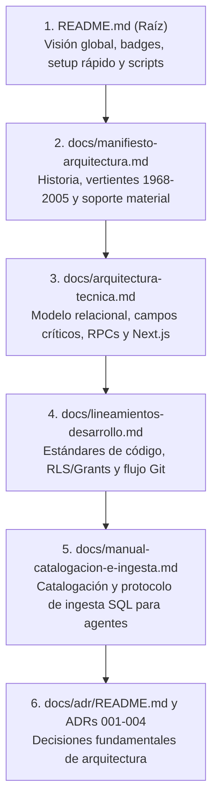

# 🤖 Manual Operativo del Proyecto para Agentes de IA y Desarrolladores (Kumbia Sound)

> **Guía Maestra de Arranque, Contexto Arquitectónico y Reorganización Estándar**  
> *Lectura prioritaria y obligatoria para cualquier agente autónomo o ingeniero que deba inicializar, auditar, refactorizar o extender el repositorio de Kumbia Sound.*

---

## 1. 🎯 Contexto Rápido del Proyecto y Cambios Recientes

**Kumbia Sound** es una plataforma web especializada en la preservación fonográfica, genealogía musical y análisis técnico (BPM / Camelot) de la cumbia grabada en el Perú durante su etapa de oro y evolución (**1968–2005**).

### ⚡ Resumen de Cambios y Mejoras Recientes
Cualquier agente que trabaje sobre este repositorio debe tener presente las siguientes decisiones e implementaciones consolidadas:

1. **Reorganización Estándar POSIX:**
   Se eliminaron todas las carpetas con espacios y mayúsculas en la raíz. Toda la documentación reside en [`docs/`](./), los datos de apoyo en [`docs/datos-investigacion/`](./datos-investigacion/), los esquemas DDL en [`docs/sql-referencia/`](./sql-referencia/), los activos públicos ordenados en [`public/branding/`](../public/branding/) e [`public/images/`](../public/images/), y los datos SQL de inserción en [`supabase/data/`](../supabase/data/).
2. **Soporte Físico Estricto a Lados A y B:**
   En los soportes de la época (45 RPM, LPs y Casetes), únicamente existen **Lado A** y **Lado B**. Está formalmente prohibido introducir Lados C o D en cualquier tabla, validación o componente.
3. **Seudónimos y Créditos de Galleta ("Piratería Blanca"):**
   Se implementó la columna opcional `credito_como TEXT NULL` en `Tema_Musicos` y `Temas_Compositores` para reflejar nombres ficticios usados para eludir contratos de exclusividad disquera, manteniendo la clave foránea vinculada a la persona real en `Personas`.
4. **Mosaicos, Popurrís y Enganchados:**
   Se mantiene el surco físico continuo en `Albumes_Temas` (`es_mosaico = TRUE`) y se desglosan las obras individuales en la tabla intermedia `Mosaicos_Temas` (`orden_segmento`, `duracion_segmento_segundos`), protegiendo la autoría y las métricas armónicas.
5. **Procedimientos Almacenados en PostgreSQL (RPC):**
   * `get_arbol_genealogico(p_persona_id INT)`: Retorna un objeto JSON con la biografía, bandas como director o integrante de planta, sesiones instrumentales y canciones compuestas.
   * `get_genealogia_versiones(p_tema_id INT)`: Resuelve el árbol completo de covers mediante `WITH RECURSIVE`, con ascenso a la raíz original y descenso con prevención matemática de ciclos (`camino || v.id_tema`).
6. **Segregación de Servicios Supabase en Next.js:**
   * Navegador: [`genealogia-service.ts`](../src/features/genealogia/services/genealogia-service.ts) usa `@/lib/supabase/client`.
   * Servidor: [`genealogia-service.server.ts`](../src/features/genealogia/services/genealogia-service.server.ts) usa `@/lib/supabase/server`.
   * *Prohibido importar `@/lib/supabase/server` en archivos con `'use client'`.*
7. **Pipeline Multimedia WebP en Cliente (`/admin`):**
   El componente `ImageUploader` intercepta JPG/PNG y los convierte a WebP (0.90) mediante HTML5 Canvas API antes de enviarlos a Supabase Storage.
8. **SEO Patrimonial (Schema.org / JSON-LD):**
   Inyección de datos estructurados para `MusicAlbum`, `MusicRecording`, `MusicGroup`, `Person` y `RecordLabel` en Server Components ([`src/app/album/[id]/page.tsx`](../src/app/album/[id]/page.tsx)).

---

## 2. 📖 Secuencia Mandatoria de Lectura Documental

Si actúas como un agente que acaba de recibir este repositorio, **debes leer los documentos en el siguiente orden estricto** para construir un modelo mental coherente antes de escribir o modificar código:



### Detalle de la Secuencia:
1. [`README.md`](../README.md): Te da la fotografía ejecutiva del stack tecnológico, variables de entorno requeridas y scripts de npm.
2. [`docs/manifiesto-arquitectura.md`](manifiesto-arquitectura.md): Te enseña la dimensión histórica del archivo (cumbia costeña, amazónica, chicha, norteña, tecnocumbia) y la justificación de por qué el modelo refleja el soporte físico y no un streaming digital genérico.
3. [`docs/arquitectura-tecnica.md`](arquitectura-tecnica.md): Te detalla el esquema DDL, el diccionario de campos críticos (`id_album_origen`, banderas físicas, `es_mosaico`, `credito_como`), el diseño de las funciones RPC recursivas y la arquitectura de Next.js App Router.
4. [`docs/lineamientos-desarrollo.md`](lineamientos-desarrollo.md): Te indica la política de seguridad estricta para credenciales, la concesión obligatoria de `GRANT` para Supabase Data API, la segregación de clientes de Supabase y el flujo Git de Conventional Commits en español.
5. [`docs/manual-catalogacion-e-ingesta.md`](manual-catalogacion-e-ingesta.md): Manual para catalogadores y protocolo mandatorio de ingesta SQL para agentes (conversión a segundos, exclusividad Camelot, flags booleanas vacío=NO, separación letra/nota agente/comentarios, trazabilidad 45 vs LP, mosaicos y seudónimos).
6. [`docs/adr/README.md`](adr/README.md): Te presenta los 4 ADRs del proyecto:
   * [ADR 001](adr/001-soporte-estricto-lados-a-b.md): Exclusividad Lado A y B.
   * [ADR 002](adr/002-modelado-mosaicos-y-enganchados.md): Mosaicos_Temas.
   * [ADR 003](adr/003-resolucion-grafo-genealogico-rpc.md): RPCs recursivas.
   * [ADR 004](adr/004-conversion-cliente-webp.md): Canvas WebP en el navegador.

---

## 3. 🏗️ Layout Canónico del Repositorio (Estructura Objetivo)

Todo el proyecto debe ajustarse sin excepción a la siguiente estructura de directorios estándar POSIX:

```text
cumbia-peruana/
├── docs/                                # Documentación formal (Docs-as-Code)
│   ├── adr/                             # Architecture Decision Records
│   │   ├── 001-soporte-estricto-lados-a-b.md
│   │   ├── 002-modelado-mosaicos-y-enganchados.md
│   │   ├── 003-resolucion-grafo-genealogico-rpc.md
│   │   ├── 004-conversion-cliente-webp.md
│   │   └── README.md
│   ├── datos-investigacion/             # Control tabular (.ods) y notas de sellos (.txt)
│   ├── sql-referencia/                  # DDL estructural consolidado de referencia
│   ├── arquitectura-tecnica.md          # Especificación del modelo relacional y RPCs
│   ├── manual-catalogacion-e-ingesta.md # Manual operativo y protocolo de ingesta SQL para agentes
│   ├── lineamientos-desarrollo.md       # Guía de setup, estándares y flujo Git
│   ├── manifiesto-arquitectura.md       # Manifiesto histórico y grafo fonográfico
│   └── manual-proyecto.md               # Este manual para agentes y desarrolladores
├── public/                              # Activos estáticos públicos
│   ├── branding/                        # Logotipos oficiales e isotipos (kumbia-sound-logo*.png)
│   └── images/                          # Fotografías históricas y hero brutalista (hero-brutalist.png)
├── scripts/                             # Scripts de automatización
│   └── poblar-db.mjs                    # Sincronización idempotente hacia Supabase Data API
├── src/                                 # Código fuente de Next.js App Router
│   ├── app/                             # Rutas, layouts y páginas (/, /album/[id], /admin, etc.)
│   ├── components/                      # Componentes UI reutilizables y SEO JSON-LD
│   ├── features/                        # Módulos desacoplados de dominio (Feature-Driven)
│   │   ├── albumes/                     # Componentes y visualización de álbumes
│   │   ├── genealogia/                  # Árboles genealógicos y servicios RPC segregados
│   │   ├── storage/                     # ImageUploader con pipeline Canvas WebP
│   │   ├── temas/                       # TracklistTable con pestañas analógicas A/B
│   │   └── dj-tools/                    # Rueda Camelot y filtros armónicos BPM
│   ├── lib/                             # Clientes Supabase segregados (client.ts y server.ts)
│   └── types/                           # Definiciones TypeScript de entidades y RPCs
├── supabase/                            # Base de datos relacional
│   ├── consultas/                       # Consultas SQL analíticas
│   ├── data/                            # Inserts históricos SQL (base, vinilos, casetes, canciones)
│   ├── migrations/                      # Migraciones versionadas DDL, RLS y RPCs
│   └── seed.sql                         # Catálogos base de roles y tipos de álbum
├── .env.example                         # Plantilla de variables de entorno
├── next.config.mjs                      # Configuración de Next.js
├── package.json                         # Dependencias y scripts de npm
└── README.md                            # Índice principal del repositorio
```

---

## 4. 🛠️ Guía Operativa Paso a Paso: Recreación desde Cero (Escenario A)

Si te encuentras ante un entorno vacío o debes clonar y levantar el proyecto desde cero:

### Paso 1: Clonar y Dependencias
```bash
git clone https://github.com/JorgeJordyJaimes/cumbia-peruana.git
cd cumbia-peruana
npm install
```

### Paso 2: Variables de Entorno Seguras
Copia la plantilla y configura tus variables:
```bash
cp .env.example .env.local
```
* Define `NEXT_PUBLIC_SUPABASE_URL` y `NEXT_PUBLIC_SUPABASE_ANON_KEY`.
* *Regla:* Nunca comitees credenciales reales ni las pegues en archivos Markdown.

### Paso 3: Aplicar Migraciones en Supabase
Verifica que tu proyecto de Supabase tenga ejecutadas en orden secuencial todas las migraciones contenidas en `supabase/migrations/`:
1. Esquema estructural inicial (`20260920000000_initial_schema.sql`).
2. Buckets y políticas de almacenamiento (`20260921000000_...`).
3. Permisos explícitos de Data API (`20260924000000_explicit_public_grants_for_data_api.sql`).
4. Tabla N:M de géneros (`20261003000000_create_temas_generos.sql`).
5. Mejoras históricas, `credito_como`, `Mosaicos_Temas` y funciones RPC recursivas (`20261007000000_historical_schema_and_genealogy_rpc.sql`).

### Paso 4: Poblar el Catálogo Histórico
Ejecuta el script automatizado para insertar todos los datos fonográficos consolidados en `supabase/data/`:
```bash
npm run db:poblar
```
*El script procesará los archivos SQL de `base/`, `vinilos/`, `cassete/` y `canciones/` de manera idempotente contra la Data API de Supabase.*

### Paso 5: Validar Compilación y Levantar el Servidor
```bash
npx tsc --noEmit
npm run lint
npm run build
npm run dev
```
La aplicación estará operativa en `http://localhost:3000`.

---

## 5. 🧹 Guía Operativa Paso a Paso: Reorganización de Repositorio Legado (Escenario B)

Si recibes una copia del repositorio con deuda técnica o estructura desactualizada (carpetas con mayúsculas o espacios), aplica este procedimiento exacto:

### Paso 1: Eliminar Duplicados y Consolidar Documentación
* Audita los archivos `README.md` y `PROYECTO.md` dispersos.
* Conserva únicamente `README.md` en la raíz.
* Mueve todo documento analítico o explicativo a `docs/` (`manifiesto-arquitectura.md`, `arquitectura-tecnica.md`, `lineamientos-desarrollo.md`, `manual-catalogacion-e-ingesta.md`).

### Paso 2: Unificar Base de Datos en `supabase/`
* Mueve cualquier carpeta antigua `Base de Datos/datos/` a `supabase/data/`.
* Mueve `Base de Datos/consultas/` a `supabase/consultas/`.
* Mueve cualquier DDL de respaldo a `docs/sql-referencia/estructural.sql`.
* Elimina la carpeta antigua `Base de Datos/` una vez verificada la migración.
* Actualiza en `scripts/poblar-db.mjs` la ruta de lectura hacia `supabase/data/`.

### Paso 3: Organizar Activos Multimedia (`public/`)
* Crea `public/branding/` y traslada allí los logotipos (`kumbia-sound-logo*.png`) y favicon.
* Crea `public/images/` y traslada allí las fotos de artistas y carátulas hero (`hero-brutalist.png`, etc.).
* Busca y reemplaza en todo `src/` las rutas antiguas para que apunten a `/branding/...` o `/images/...`.

### Paso 4: Mover Material Tabular a Documentación
* Mueve `DATOS TABULARES/` a `docs/datos-investigacion/`.
* Elimina la carpeta antigua `DATOS TABULARES/`.

### Paso 5: Configuración de `.gitignore` y Limpieza de Caché de Git
Asegura que `.gitignore` excluya archivos de compilación de TypeScript:
```gitignore
*.tsbuildinfo
tsconfig.tsbuildinfo
.temp/
supabase/.temp/
```
Si estaban rastreados en Git, retíralos sin borrarlos del disco:
```bash
git rm --cached -r tsconfig.tsbuildinfo .temp supabase/.temp 2>/dev/null || true
```

---

## 6. ⚠️ Reglas Inmutables y Restricciones del Dominio

Al generar nuevo código, consultas SQL o interfaces, el agente **DEBE RESPETAR ESTRICTAMENTE**:

| Regla Inmutable | Explicación Técnica y Razón de Ser |
| :--- | :--- |
| **Exclusividad de Lados A y B** | No inventar ni admitir Lados C o D en el período 1968–2005. Toda tabla física valida `CHECK (lado IN ('A', 'B'))`. |
| **Duración Siempre en Segundos** | En SQL y base de datos, toda duración se almacena como número entero de segundos (`duracion_segundos`). El agente convierte siempre `MM:SS` a segundos. Prohibido insertar strings con `:`. |
| **Camelot Exclusivo** | Solo se admite y utiliza notación Camelot (`camelot_code` tipo `1A` a `12B`). La notación clásica del círculo de quintas (`musical_key`) queda descartada del proyecto. |
| **Convención Booleana Vacío = NO** | En las hojas de datos (`Datos BD.ods`), celda vacía significa `FALSE` (`DEFAULT FALSE` en Postgres). Solo se escribe `SI` para `TRUE`. |
| **Separación Letra / Nota Agente / Comentario** | `LETRA DEL TEMA` va a `letra TEXT`, `NOTA PARA EL AGENTE` es solo para instrucciones internas (mosaicos, covers), y `COMENTARIOS / NOTAS` va a la base de datos. |
| **Data API Grants Obligatorios** | Toda nueva tabla o función RPC debe tener sentencias `GRANT ... TO anon, authenticated, service_role` y RLS habilitado. |
| **No Mezclar Clientes Supabase** | Nunca importar `@/lib/supabase/server` en archivos con `'use client'`. Usa `genealogia-service.ts` en cliente y `genealogia-service.server.ts` en servidor. |
| **No Pistas Falsas para Mosaicos** | Nunca fragmentar un surco físico de vinilo en pistas artificiales (ej. 3a, 3b). Usa `Mosaicos_Temas` con `es_mosaico = TRUE`. |
| **Preservar Identidad en Seudónimos** | Nunca crear una persona ficticia en `Personas` si se conoce la identidad del músico; usa `credito_como` en `Tema_Musicos` o `Temas_Compositores`. |
| **Solo WebP en Supabase Storage** | Nunca subir JPG o PNG directo al bucket; procesar siempre mediante el pipeline Canvas WebP en el navegador. |
| **Commits en Español** | Conventional Commits estrictamente en español (`feat:`, `fix:`, `docs:`, `refactor:`, `style:`). |

---

## 7. 🧪 Checklist de Verificación Final para el Agente

Antes de dar por concluida cualquier intervención técnica en el proyecto, ejecuta este checklist:

- [ ] **Estructura de Directorios:** No existen carpetas con espacios ni mayúsculas en la raíz.
- [ ] **Enlaces Internos:** Todos los enlaces relativos entre archivos Markdown son válidos.
- [ ] **Compilación de Tipos:** `npx tsc --noEmit` finaliza con código de salida `0`.
- [ ] **Linter:** `npm run lint` finaliza con código de salida `0`.
- [ ] **Build de Producción:** `npm run build` compila exitosamente todas las rutas de Next.js.
- [ ] **Sincronización Git:** Los cambios están commiteados en español y sincronizados en `origin/main`.
